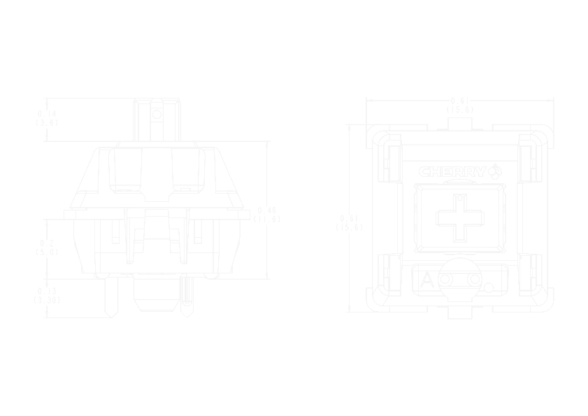
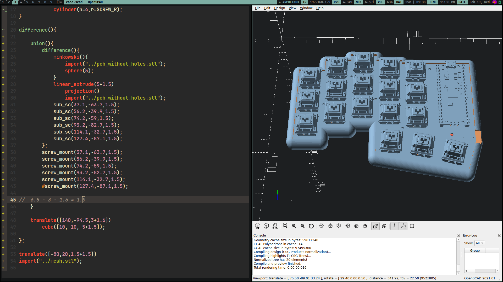
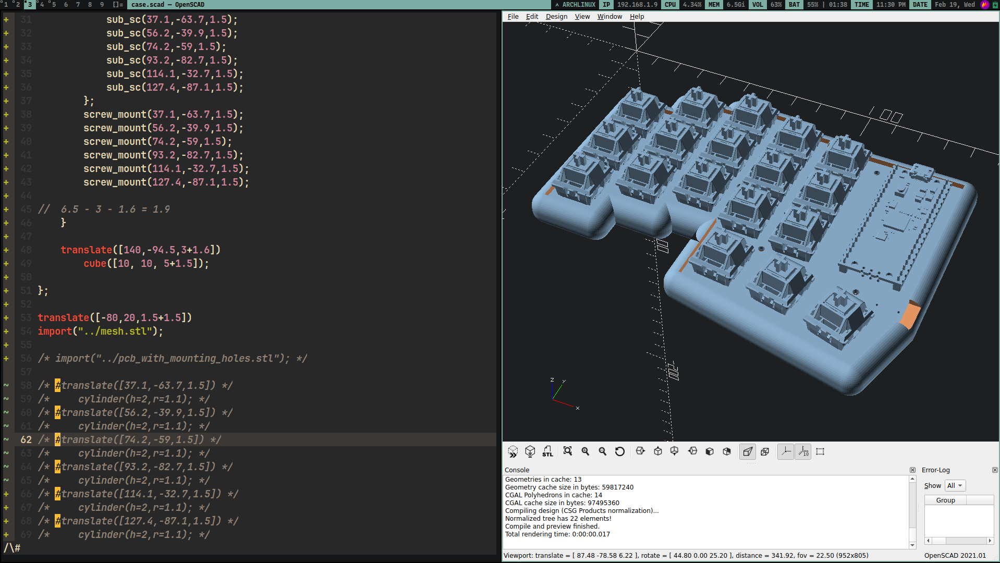
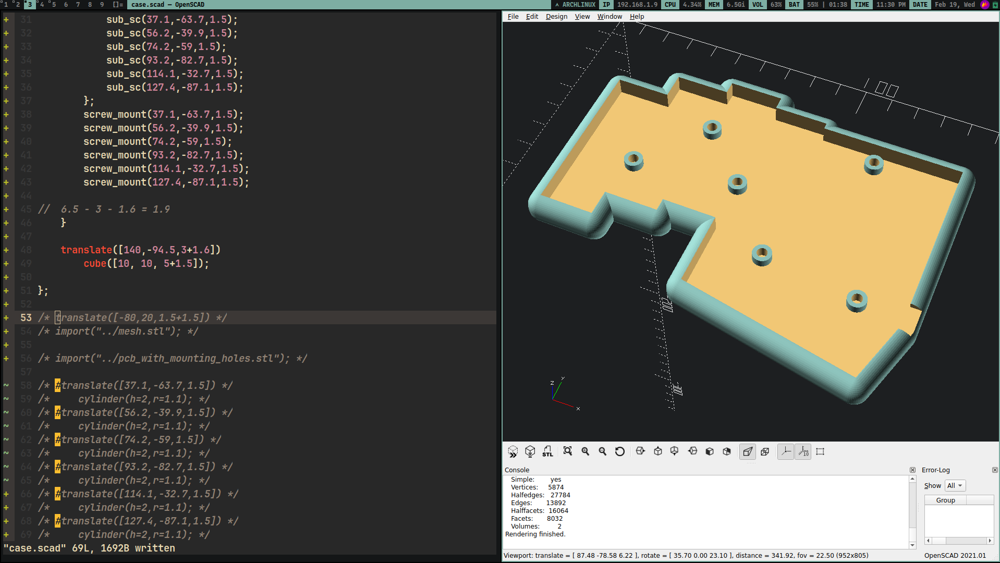
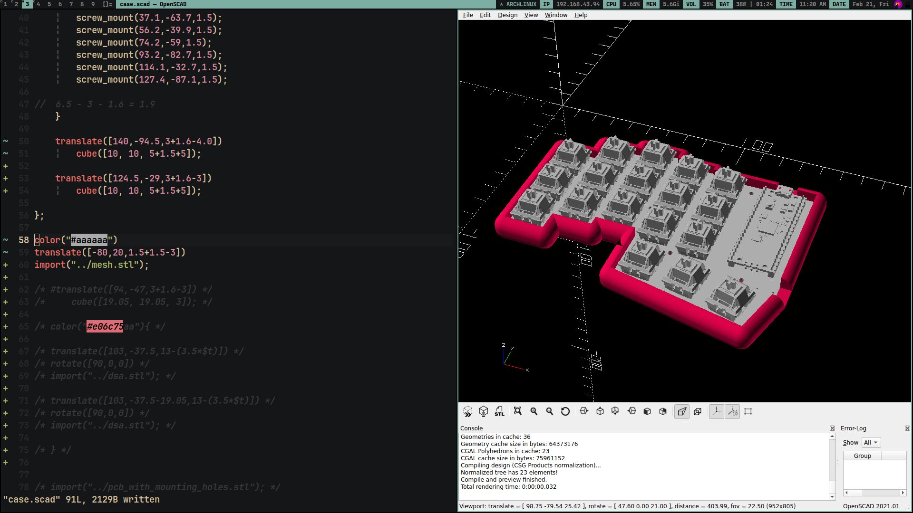
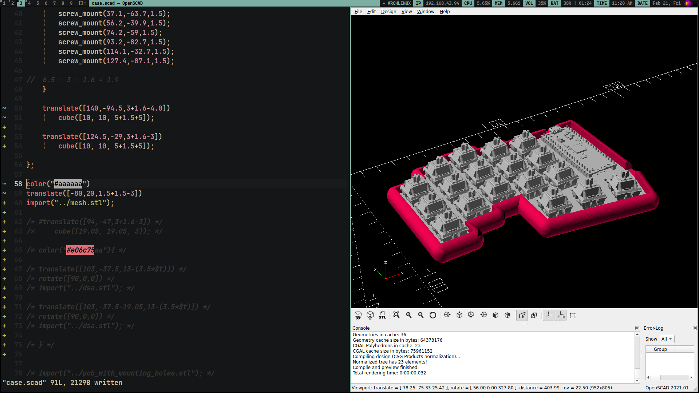
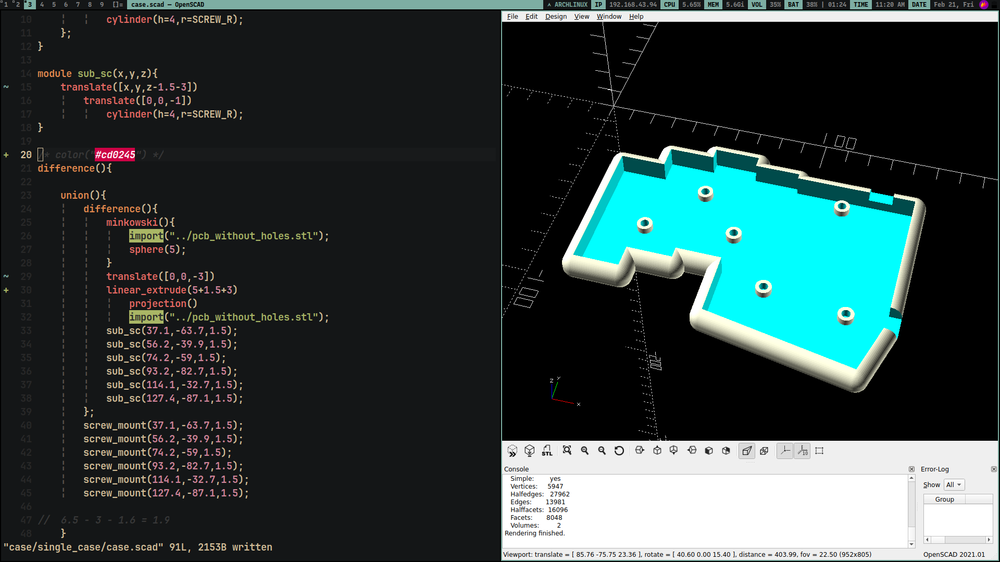
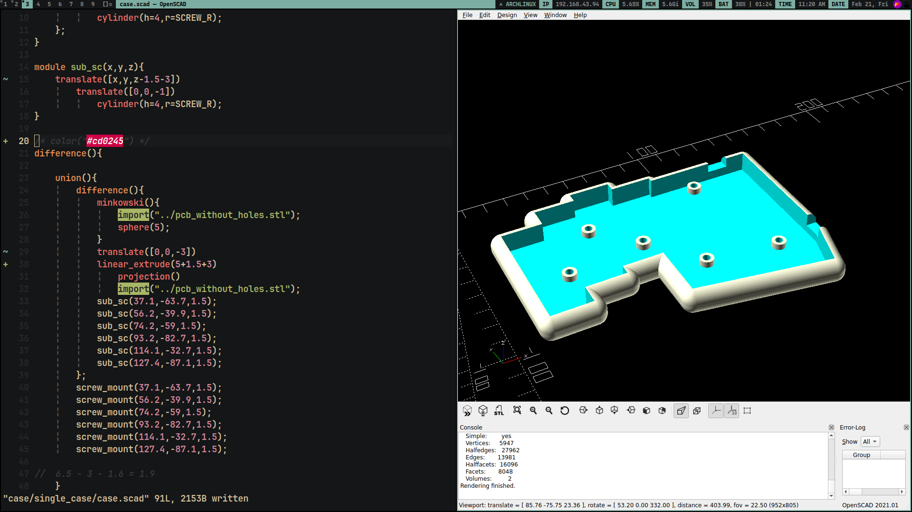

# 36 Key Split Ergonomic Keyboard

## Order

All the stuff ordered in regards to this project

> This is not the actual concise BOM\
> All this is just the stuff I ordered related to this project

- StacksKB.com
    - Akko V3 Creamy Yellow Pro Switch (Pack of 45) × 1
    - Order Number: 30456
    - Cost: 899 + 100 (delivery) = ₹ 1000
    - Order Date: 2025-02-08

- Robu.in

|Item|Qty|Cost|
|----|---|----|
| TRRS Jack | 8 | ₹ 28
| Raspberry Pi Pico | 1 | ₹ 349
| Header 1x40 pin | 12 | ₹ 88
| Ball Bearing | 2 | ₹ 38
| Handling charges | - | ₹ 25
| TOTAL | - | ₹ 528

- Robu.in (2nd)

|Item|Qty|Cost|
|----|---|----|
| USB 3.1 Female Socket Type C Connector 24 Pins Breakout PCB Board | 2	   | ₹ 98.00	
| Wire Stripper Flat Nose Cable Cutter with Practical Punch Down Tool | 1  | ₹ 18.00	
| High Quality Ultra Flexible 30AWG Silicone Wire - Black | 5		   | ₹ 25.00	
| UL1007 26AWG PVC Electronic Wire - Black | 2				   | ₹ 14.00	
| High Quality Ultra Flexible 22AWG Silicone Wire - Black | 2		   | ₹ 36.00	
| Heat Shrink Sleeve 1mm Red Industrial Grade WOER (HST) | 4		   | ₹ 20.00	
| Piezo Buzzer 35mm | 1							   | ₹ 16.00	
| Subtotal: | -								   | ₹ 227.00
| Shipping: | -								   | ₹ 49.00 via STANDARD SHIPPING
| Cash Handling Charges: | -						   | ₹ 25.00
| Total: | -								   | ₹ 301.00
- OnlyScrew.in

|Item|Qty|Cost|
|----|---|----|
| M2 X 6mm Brass Threaded Inserts (Dia. 2mm, Length 6mm) | 12			   | ₹ 26.40
| M2 X 4mm Phillips Pan head SS 304 Screw (Dia. 2mm, Length 4mm) | 12		   | ₹ 21.60
| M2 X 3mm Brass Threaded Inserts (Dia. 2mm, Length 3mm) | 12			   | ₹ 19.20
| M2 X 6mm Phillips Pan head SS 304 Screw (Dia. 2mm, Length 6mm) | 12		   | ₹ 24.00
| M2 Hex Nut SS304 (Dia. 2mm) | 12							   | ₹ 19.20
| M3 X 12mm Phillips CSK SS 304 Screw (Dia. 3mm, Length 12mm) | 10			   | ₹ 16.00
| Allen Key 2mm Chromium Vanadium Steel | 1						   | ₹ 6.20
| M3 X 12mm Hex (Allen) Button Head SS 304 Screw (Dia. 3mm, Length 12mm) | 8	   | ₹ 17.60
| Subtotal | - | ₹ 150.20
| Shipping | - | ₹ 99.00
| Taxes | - | ₹ 27.04
| Total | - | ₹ 276.24

## Case Designing
- I am aiming for a sandwich case which consists of a bottom part, middle part for padding, another plate in which pcb is resting and the top switch mount plate
- The bottom plate will be of 3mm ABS (non metal laser cut) so that the keyboard has a solid base
- The next plate is the middle one but it is a little bit smaller in inner part so that the PCB can rest on top of it
    - this plate's height will be -> 3mm because we need at least (3.3-1.6) = 1.7mm clearance and having another 1.3mm would be nice so that the soldered wires can go through
    - note: 3.3mm is the distance between the bottom-most point of the MX switch and the point which rests on the PCB
    - and the height of the PCB is 1.6mm
- Next is the other bottom plate with the pcb cutout in the middle so that the pcb can be put into it and also provides the gap between the previous middle layer and the switch mount plate
    - This will be of height -> (5-1.5)+(1.6) = 5.1mm
- Lastly, we have the switch mount plate which obviously holds the MX switches and needs to be 1.5mm in height

## Materials Used for the case (complex case)

| Plate | Material | Cost |
|---|---|---|
|Bottom|Laser cut Acrylic 3mm | 
|Middle|Laser cut Acrylic 3mm|
|Middle v2|Laser cut Acrylic 5mm|
|Top|ABS FDM 3d printed|

> As of now (025-02-19 23:20), I am pausing this sandwich case idea and shifting to just a single case which encloses the PCB from the bottom and sides\
> I would have preferred to have a switch mount plate as well because it adds stability and reduces dust residue in the keyboard but I would like to get started with a simpler case than the sandwich one and also, I would like to use the existing mounting stuff I have bought i.e. the m2x3mm brass inserts and hence I am heading for this approach

## Simple Case

- This case was costing me about Rs. 389 on https://robu.in with ABS and 15% infill
- I believe that is a bit high for me since this is just half of the keyboard
- So, I reduced the cost down to about Rs. 300 by putting the PCB a bit lower and instead of the 5mm solid base, we now have a 2mm solid base which makes a little bit less solid but its not a huge problem
- This is the case with the PCB after the cost cut

- Order placed for this case for Rs.335 along with the mount plate for this project -> https://github.com/aditya23043/Tekken_Controller
- Totalling: Rs. 463 (335 + 79 (mount plate) + 49 (delivery))
